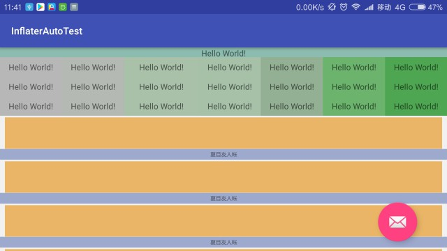

# InflaterAuto
UI适配库(AndroidAutoLayout替代方案)

#### 图例
以下设计图纸为720_1280(图例分辨率分别为:1080_1920、480_800、1920_1080)，布局中不属于ViewGroup的布局设置都是
采用layout_width="px",android:layout_height="px",android:layout_marginTop="px",android:paddingLeft="px"具体px值设置
<br/>
<br/>


<br/>



## 概述
本库由LayoutInflater入手，更改获取布局解析服务的方法，返回我们自己的布局解析器，在创建View的完成时
，就对View（包括子View，如果有）的LayoutParams进行调整，来做适配，这个步骤是在View开始测量绘制之前，不会造成二次
绘制，性能上除了View创建完成时对其递归调整LayoutParams之外，是没有任何影响的。

#### 选择切入点
```
view的设置LayoutParams是在LayoutInflater的rInflate方法中执行的
void rInflate(XmlPullParser parser, View parent, Context context,
           AttributeSet attrs, boolean finishInflate) throws XmlPullParserException, IOException {
    ...
    final View view = createViewFromTag(parent, name, context, attrs);
    final ViewGroup viewGroup = (ViewGroup) parent;
    final ViewGroup.LayoutParams params = viewGroup.generateLayoutParams(attrs);
    rInflateChildren(parser, view, attrs, true);//这里是递归调继续创建View
    viewGroup.addView(view, params);
    ...
    }
```
可以看到，LayoutParams是在这里创建的，这个方法是我们最需要更改操作的，然而我们并不能覆写这个方法，AndroidAutoLayout有一系列的Auto开头的ViewGroup
，其重写的也就是generateLayoutParams，直接返回调整过的params，然而它仍然需要在OnMeasure的时候对所有子View内部相关属性做调整，为了提升效率，
2.x不在返回整个View后递归调整，而是，采用View自身的属性，在View生成后直接调整，LayoutParams在父类的生成后直接调整，可调整LayoutParams的父类配置注解，在编译时自动生成。

## gradle
implementation 'com.yan:inflaterauto:2.0.01'
annotationProcessor 'com.yan:inflaterauto-compiler:2.0.01'

## 使用
```
// application 初始化
public class InflaterAutoApp extends Application {

    @Override
    public void onCreate() {
        super.onCreate();

        /*
         * 以下可以写在任何地方，只要在生成View之前
         */
        InflaterAuto.init(new InflaterAuto.Builder()
            .width(720)
            .height(1280)
            .baseOnDirection(InflaterAuto.BaseOn.Both)// 宽度根据宽度比例缩放，长度根据长度比例缩放
            .inflaterConvert(new InfAutoInflaterConvert())// 由 com.yan.inflaterautotest.InflaterConvert 编译
            .build()
        );
    }


    /**
     * 如果你使用了LayoutInflater.from(getApplicationContext())或者LayoutInflater.from(getApplication())
     * 就需要以下操作，如果没有，以下方法不必重写
     */
   @Override
    protected void attachBaseContext(Context base) {
        //替换Inflater
        super.attachBaseContext(InflaterAuto.wrap(base));
    }
}

// activity 重写attachBaseContext
public class MainActivity extends AppCompatActivity {
    @Override
    protected void attachBaseContext(Context base) {
        //替换Inflater
        super.attachBaseContext(InflaterAuto.wrap(base));
    }
}

// 注解设置，types 你用到ViewGroup
// 如果是你自定义的，只会重写参数为context的构造函数和参数为context, attributeSet的构造函数
// 如果是你自定义View还有用到了其他构造函数请用typesCount
@Convert(types = {LinearLayout.class
        , FrameLayout.class
        , NestedScrollView.class
        , RecyclerView.class
        , ListView.class
        , ScrollView.class
        , CoordinatorLayout.class
        , ConstraintLayout.class
        , AutoLayout.class
}
//        , typesCount = {
//        "com.yan.inflaterautotest.AutoLayout|1100"// "|" 左边全类名，
//                                                  // 右边 "1100"
//                                                  // 第一个1表示覆写参数为context的构造函数
//                                                  // 第二个1表示覆写参数为context, attributeSet的构造函数
//                                                  // 第三个0表示不覆写参数为context, attributeSet, defStyleAttr的构造函数
//                                                  // 第四个0表示不覆写参数为context, attributeSet, defStyleAttr, defStyleRes的构造函数
//}
)
public abstract class InflaterConvert implements AutoConvert {// 类名随便写，可以不实现AutoConvert
}
```


